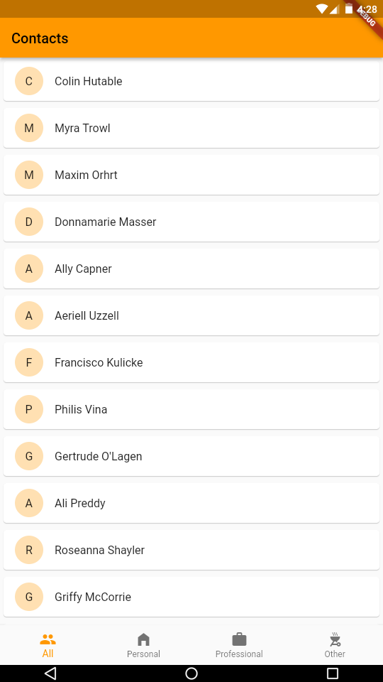
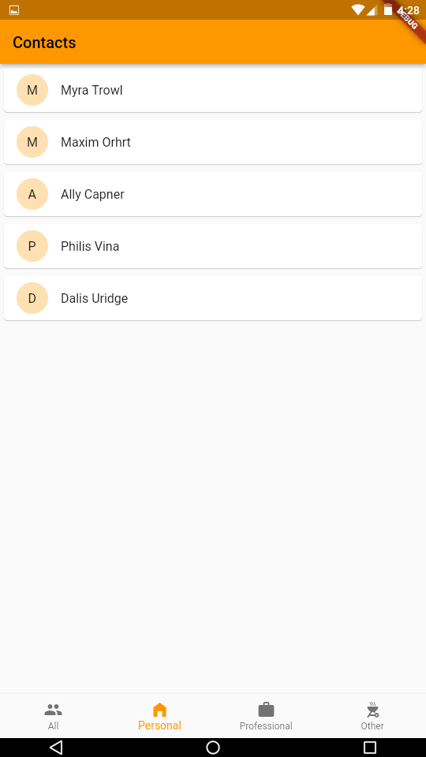
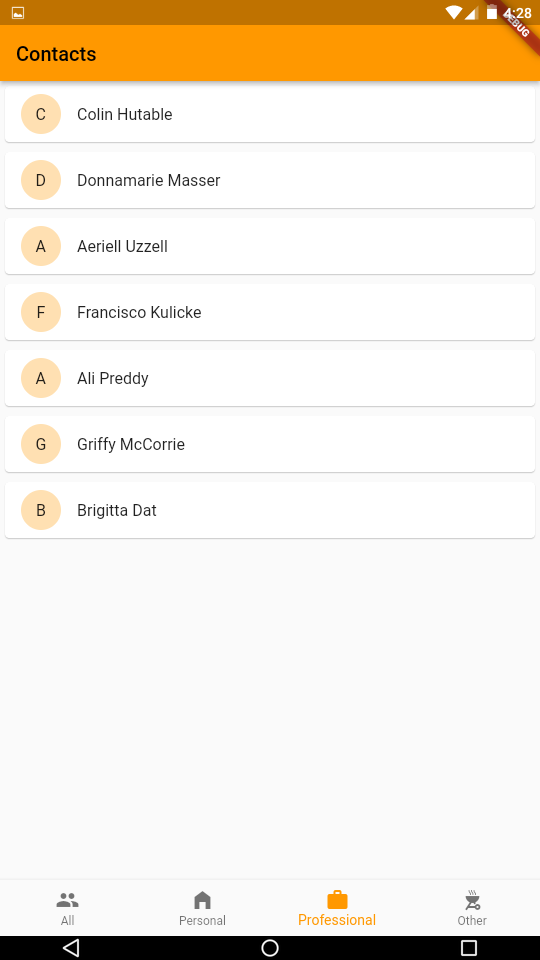
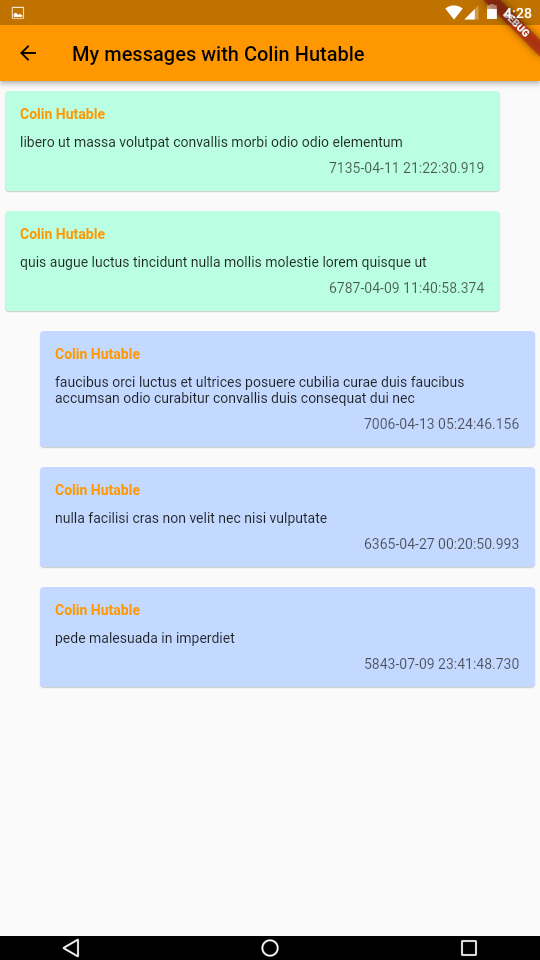

# enset_chat_app

**Screenshots**
All contacts

Contacts of 'Professional' group

to do

- [x] Message repo impl
- [x] bloc impl
- [x] Navgate to conversation
- [x] Conversation page
- [x] On click a contact show list of messages
- [x] Messages ui
- [ ] sending message progress
