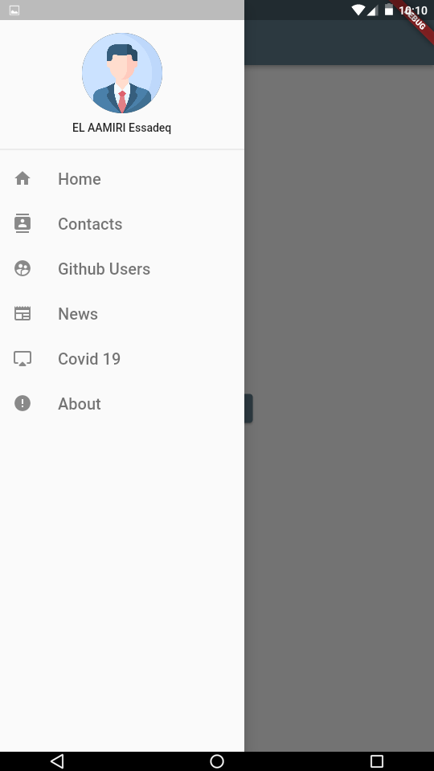
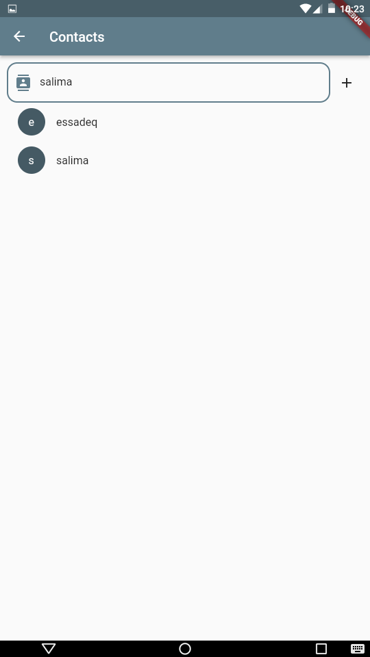
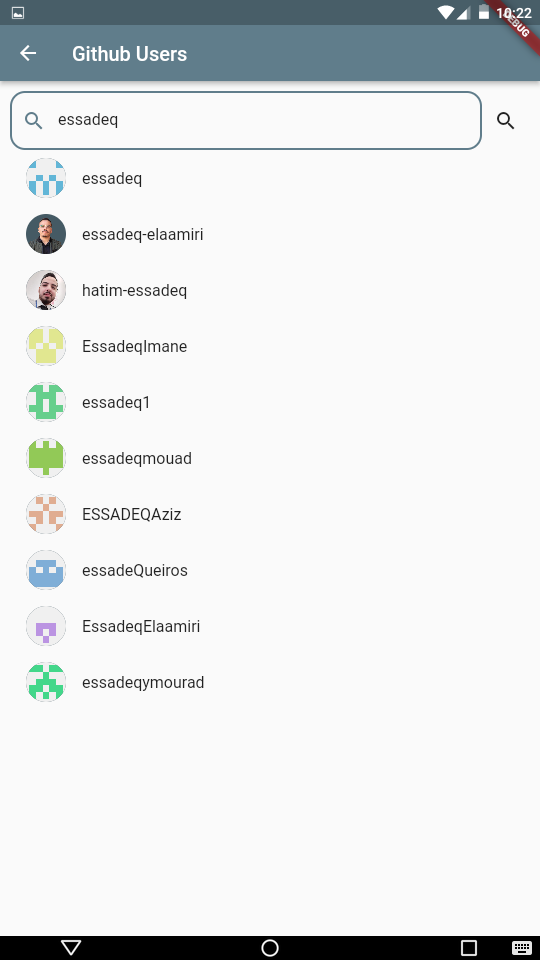
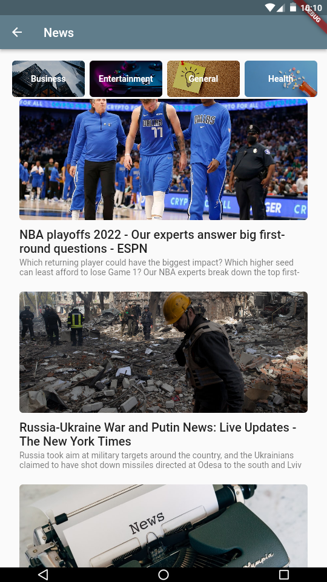
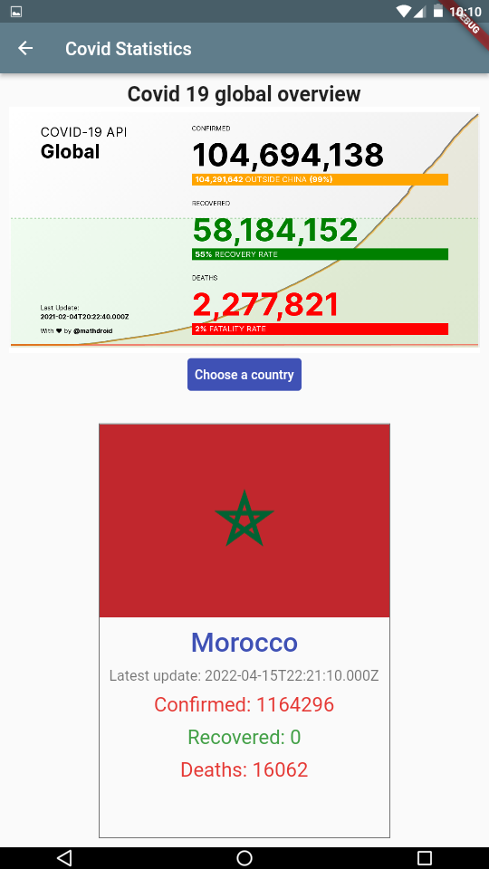
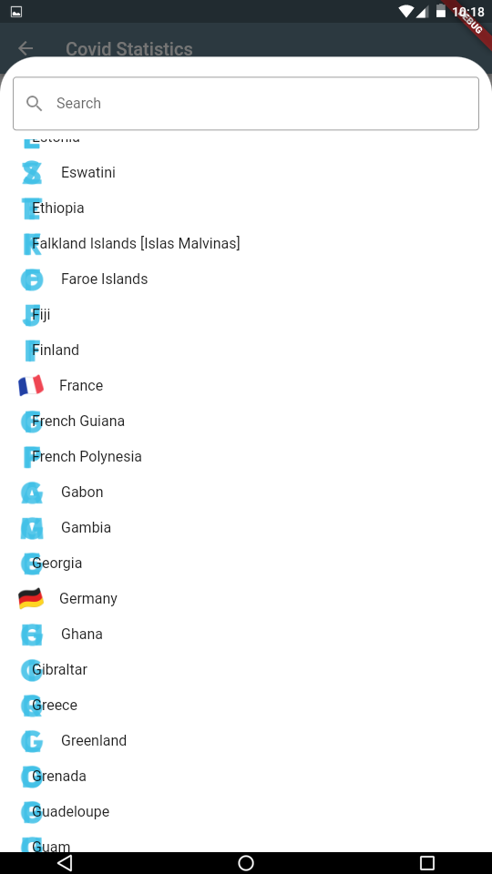
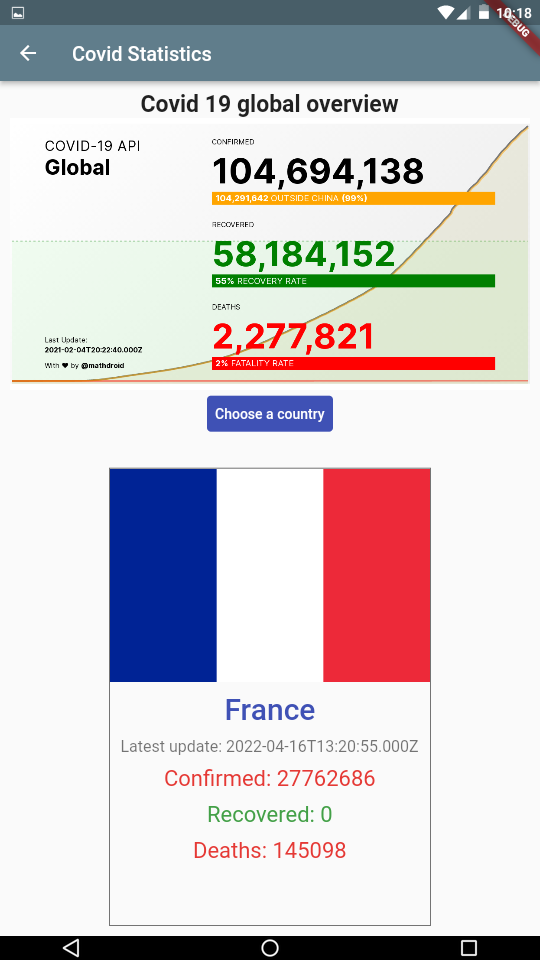

# global_tp

A new Flutter project.

## Getting Started

This project is a starting point for a Flutter application.

A few resources to get you started if this is your first Flutter project:

- [Lab: Write your first Flutter app](https://flutter.dev/docs/get-started/codelab)
- [Cookbook: Useful Flutter samples](https://flutter.dev/docs/cookbook)

For help getting started with Flutter, view our
[online documentation](https://flutter.dev/docs), which offers tutorials,
samples, guidance on mobile development, and a full API reference.

###### Problem:

something like this:

```diff
this class is to Unhandled Exception: HandshakeException: Handshake error in client (OS Error:
CERTIFICATE_VERIFY_FAILED: ok(handshake.cc:354))
```

###### Solution

1. adding this class to the main.dart

```dart
// libs : import 'dart:io';

class MyHttpOverrides extends HttpOverrides {
  @override
  HttpClient createHttpClient(SecurityContext? context) {
    return super.createHttpClient(context)
      ..badCertificateCallback =
          (X509Certificate cert, String host, int port) => true;
  }
}

```

2. calling the class (to overriding settings) in the `main` function

```dart
void main() {
  HttpOverrides.global = new MyHttpOverrides();
  runApp(MyApp());
}
```

#### Detecting emilator by VSCode!

```diff
> $ adb connect 127.0.0.1:62001
connected to 127.0.0.1:62001

```

### screenshots

|    |    |    |
| ------------------------------------ | -------------------------------------- | ------------------------------------------ |
|   |  |  |
|  |    |                                            |
